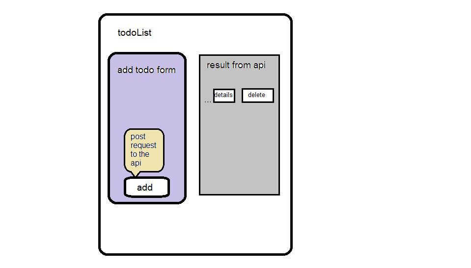

# LAB - Class 32

## Context API

### Author: obada al-quran

### Links and Resources

- [github pages](https://obadeh.github.io/Custom-Hooks/)

### Setup

#### `.env` requirements (where applicable)

i.e.

- `PORT` - Port Number
- `MONGODB_URI` - URL to the running mongo instance/db

#### How to initialize/run your application (where applicable)

- e.g. `npm start`

#### Tests

- How do you run tests?
- Any tests of note?
- Describe any tests that you did not complete, skipped, etc

#### UML

